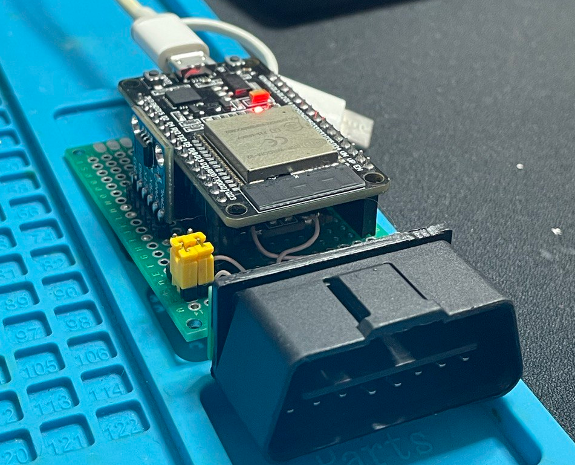

# CanHacker (lawicel) CAN adapter on ESP32 + generic CAN

Fork from [autowp/arduino-canhacker]([https://github.com/autowp/arduino-mcp2515](https://github.com/autowp/arduino-canhacker)).

Selection of CAN controller is performed by define USE_ESP32_INTERNAL_CAN

The Main features are preserved, but there are some issues:
- no interrupt mode, only polling
- no loopback mode
- no listen-only mode
- bad CAN bitrate calculation (125kbps is 250kbps, 250kbps is 500kbps and so on)
- to keep original code, the ESP32SJA1000Class::filterMask() should be
  separated to two functions for setting filter and mask. And there is
  still issues with it. Anyway, this code needs to rework.

